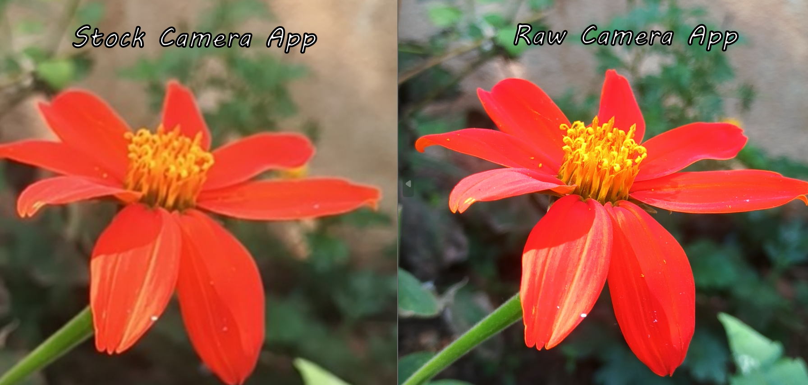

#  RAW Camera App — Android (Camera2 API)

An advanced Android camera application built using the Camera2 API that provides manual sensor control and RAW image capture. The app demonstrates the difference between standard smartphone image processing and RAW image output for better post-processing flexibility.

---

##  Features

-  Real-time camera preview using Camera2 API  
-  Manual camera controls:
  - ISO (sensor sensitivity)
  - Shutter speed (exposure time)
  - Focus distance (manual focus control)
-  Dual capture modes:
  - RAW capture (DNG format using `DngCreator`)
  - Processed image capture (PNG format)

---

##  RAW vs Stock Camera Comparison

Below is a real-world comparison of image output captured on a **Redmi 13C 5G** device:

- Stock camera processed image vs RAW camera output  
- Shows differences in:
  - Dynamic range
  - Color flexibility
  - Detail preservation

---

### 📊 Comparison Image

---

##  Tech Stack

- Kotlin / Android
- Camera2 API
- ImageReader API
- DngCreator (RAW image generation)
- YUV_420_888 image processing
- MediaStore API

---

##  How It Works

1. Initializes Camera2 API and selects back camera  
2. Starts real-time preview using TextureView  
3. Applies manual sensor settings using CaptureRequest  
4. Captures image based on selected mode:
   - RAW → Saves DNG using `DngCreator`
   - PNG → Converts YUV → Bitmap → Compresses to PNG  
5. Saves output to device gallery via MediaStore  

---

##  Requirements

- Android 8.0+
- Device with RAW sensor support (recommended for full functionality)

---

##  Author

Rohan Gaikwad  
